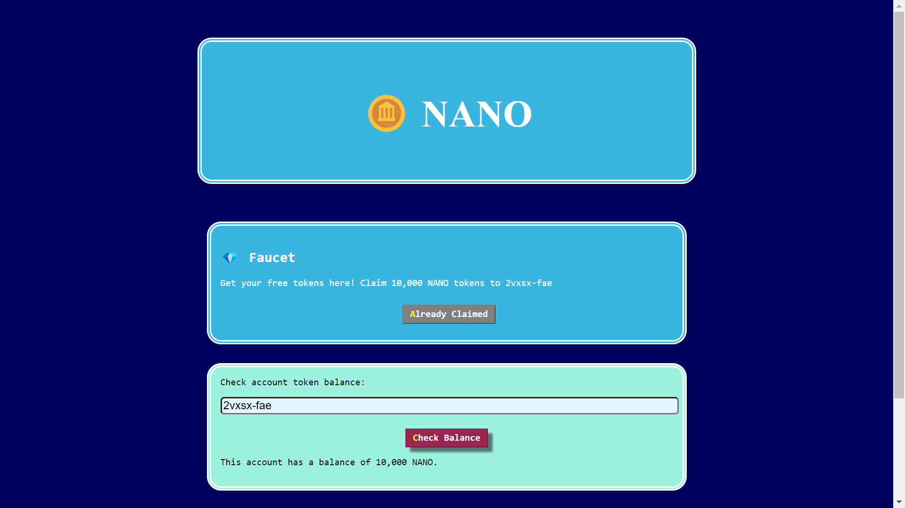

# NANO Token
> This repository contains information about the `NANO Token` , which is built on the `Internet Computer` blockchain. The Internet Computer is a decentralized platform that allows for the creation and transfer of tokens.

## What is Token Name?
> NANO token is a digital asset that can be used as a form of payment, a store of value, or a representation of a physical or virtual asset. It is built on top of the Internet Computer and can be transferred between users on the blockchain.

## How to get NANO ?
> NANO can be acquired through a token sale, mining, or on decentralized exchanges. A new user can claim free 10,000 NANO.

## How to use NANO
> NANO can be used as a form of payment for goods and services, or as a store of value. It can also be used to participate in decentralized applications built on the Internet Computer.




### Link :coin: https://4pk4l-nqaaa-aaaap-aax4q-cai.raw.ic0.app/

## Getting Started

These instructions will help you get a copy of the project up and running on your local machine for development and testing purposes.

### Prerequisites

Before you can run the code, you will need to have the following software installed:

- [Internet Computer CLI](https://docs.dfinity.org/docs/sdk/install)
- [Node](https://nodejs.org/en/)

### Installing
1. Clone the repository: `git clone https://github.com/Sindhuinti/nano-token.git`
2. Navigate to the project directory: `cd nano-token`

## To Deploy

1. Find out your principal id:

```
dfx identity get-principal
```

2. Replace the <REPLACE WITH YOUR PRINCIPAL> in main.mo with the principal you got from step 1.

```
  let owner : Principal = Principal.fromText("<REPLACE WITH YOUR PRINCIPAL>");
```

3. Open up a new terminal in this VSCode project and deploy the token canister:

```
dfx deploy
```

4. Start the frontend:

```
npm start
```

5. Set the canister id to a local variable:

```
CANISTER_PUBLIC_KEY="principal \"$( \dfx canister id token )\""
```

6. Transfer half a billion tokens to the canister Principal ID:

```
dfx canister call token transfer "($CANISTER_PUBLIC_KEY, 500_000_000)"
```

7. Claim the tokens from the faucet on the frontend website.

8. Get token canister id:

```
dfx canister id token
```

## Usage

Once the tokens are deployed, you can interact with them using the Internet Computer CLI. See the [DFinity documentation](https://docs.dfinity.org/docs/sdk/ic-cli) for more information on how to do this.

## Contributing

If you would like to contribute to the development of these tokens, please fork the repository and create a pull request.


